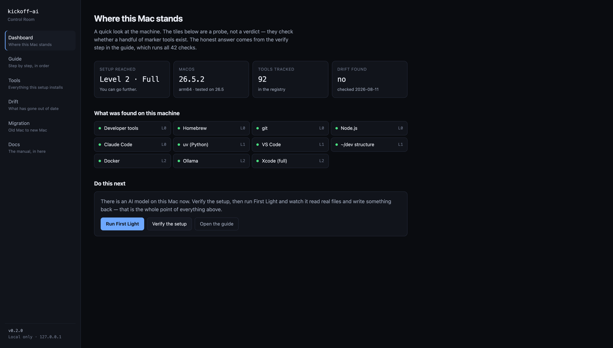
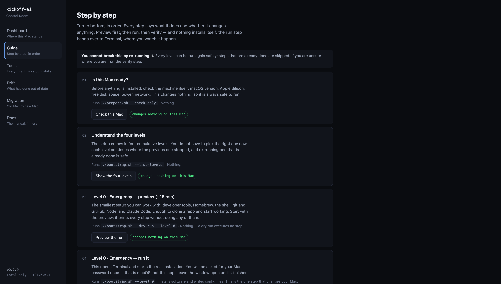
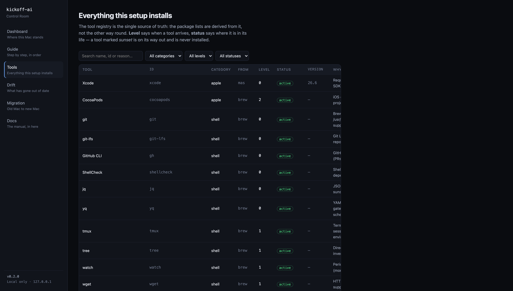

# kickoff-ai

> Every setup is correct on the day it's made — and never again. This one knows when it stops being true, and shows you where you stand before it changes anything.

[](LICENSE)
[](#what-this-is-not)
[](https://github.com/koalaman/shellcheck)
[](https://github.com/leonkoellerwirth-arch/kickoff-ai/actions/workflows/validate.yml)

From a blank Mac to a working, verified AI development environment — guided by a local
Control Room in your browser. One command to start, 42 checks to prove it, and a tool
registry that reports its own drift. At the end, you don't read that it worked.
You watch an agent do something on your machine.



---

## The principle

**The machine reports; the human decides.**

Nothing in this repository installs, removes, or retires anything on its own. Every check is
read-only. Every change is previewed before it runs, runs visibly in Terminal, and is verified
after. The Control Room shows two badges and means them: `changes nothing on this Mac` and
`changes your Mac` — and the second one always waits for you.



Every step names the command it runs, so nothing is hidden behind a button, and the same three
classes govern an agent driving this repo — see the [Operator Playbook](docs/12-OPERATOR-PLAYBOOK.md).

---

## Three ways in

**1 — See where you stand.** Changes nothing. Once the repo is on the machine:

```bash
./start.sh
```

This opens the Control Room at `127.0.0.1` — local only, nothing leaves the machine. It shows
what's installed, what's missing for each level, what has drifted, and puts every command in
this README behind a button with a plain-language explanation. It needs only `python3`.

**2 — Set up a brand-new Mac.** No Homebrew, no git, no repo yet:

```bash
/bin/bash -c "$(curl -fsSL https://raw.githubusercontent.com/leonkoellerwirth-arch/kickoff-ai/main/prepare.sh)"
```

`prepare.sh` checks readiness, installs the Xcode Command Line Tools, clones the repo, and
hands off to Level 0. To check readiness only, append `-- --check-only` — that run changes
nothing. `curl | bash` is trust by definition; [SECURITY.md](SECURITY.md) explains the threat
model and how to verify before running.

**3 — Let an agent drive.** Install [Claude Desktop](https://claude.com/download), open
Cowork, and say:

> *Clone github.com/leonkoellerwirth-arch/kickoff-ai and set up my Mac with it.*

The agent reads the [Operator Playbook](docs/12-OPERATOR-PLAYBOOK.md) and takes it from
there — explaining each step in plain language, asking before anything that changes the
machine, verifying after each level. You decide; it works.

---

## The problem this solves

Tools move. Homebrew formulas get deprecated. npm packages go unmaintained. The AI CLI you
pinned six months ago is three major versions behind. And the setup that was exact on day one
drifts silently until the next machine migration reveals the gap.

Most setup repositories have no answer for this. They are documentation, not systems.

There is a second problem, newer and worse: every first contact with AI agents starts from
zero. A capable person sits in front of a capable machine, and two weeks disappear into
"getting the environment right" before anything visible happens. This repo compresses that
into an afternoon — and ends it with proof, not a checklist.

## What makes this different

| Pillar | What it does | Numbers |
| --- | --- | --- |
| **Staged installation** | One command, four cumulative levels: emergency shell in 15 min, full AI stack in 2 h | 12 modules, `--dry-run` on everything |
| **Verification** | `doctor.sh` checks every layer after setup — read-only, with a concrete fix per finding | 42 checks, PASS / WARN / FAIL |
| **Currency system** | A registry is the single source of truth; CI opens a PR for version drift and an issue for rot every Monday | `candidate → active → deprecated → sunset`, 90-day window |
| **Migration** | `status-quo.sh` exports the old machine; `migration-diff` shows what the new one is still missing | Machine-readable `profile.json`, concrete commands per gap |
| **First Light** | The final guided step: an agent performs a small, real task in a fenced folder, in front of you | Under a minute; works offline via a local model |

These counts are enforced, not remembered: a CI check recomputes them from the sources on
every push and fails the build if this README disagrees. Drift detection applies to the
documentation too.

The pattern underneath — declared inventory, explicit lifecycle states, machine detection with
human decision, read-only verification, traceable change — is described on its own in
**[docs/11-GOVERNANCE-PATTERN.md](docs/11-GOVERNANCE-PATTERN.md)**. If you never run a single
script here, that document is the part worth reading.

## The four levels

| Level | Time | After this level |
| --- | --- | --- |
| 0 — Emergency | ~15 min | Clone repos, commit to git, run Claude Code, start pnpm projects |
| 1 — Base | ~45 min | + Python via uv, VS Code with extensions, paved road (`base new`) |
| 2 — Full | ~2 h | + Docker, full Xcode, Codex CLI, Gemini CLI, Ollama + local models |
| 3 — Maximal | ~3 h+ | + optional Brewfile, automation layer with launchd jobs |

Each level includes everything from the previous one. Re-running a completed level is safe —
you cannot break this by running it twice. You do not have to pick the right level up front;
the Guide in the Control Room walks each one as preview → run → verify.

After a full setup, `doctor.sh` prints a structured result. Real output from the AI-tools
section:

```
==> AI Tools
[PASS]  Claude Code                              2.1.231 (Claude Code)
[PASS]  @openai/codex                            0.147.0
[PASS]  Gemini CLI                               0.46.0
[PASS]  Ollama                                   0.32.4
[PASS]  Ollama models                            glm-ocr:latest,llama3.2:latest,deepseek-r1:14b,aya-expanse:8b
```

WARN and FAIL entries each include a concrete fix command. FAILs block the setup as complete.

## What's inside

```
start.sh                Opens the Control Room — local app, changes nothing
prepare.sh              Entry point for bare machines — no git or Homebrew needed
bootstrap.sh            Orchestrator — runs modules in order, levels 0–3
doctor.sh               Read-only verification — 42 checks, exit 1 on FAIL
status-quo.sh           Export the current machine state before migration

app/                    The Control Room: dashboard, guide, registry, drift, migration
scripts/                12 numbered modules, plus opt-in legacy cleanup and First Light
manifests/tools.yaml    The public registry — curated reference, single source of truth
local/                  Gitignored — machine-specific findings, snapshots, private overrides
automation/bin/         14 commands — drift checks, sunset lifecycle, hygiene, backups
docs/                   Zero-to-hero guide, decisions (ADR), governance pattern, playbooks
```



Machine-specific state never lives in the public registry: what a scan finds on *a* machine
goes to `local/manifests/tools.local.yaml`, which is gitignored by design. The public manifest
is a reference; your machine's state is yours. A CI guard keeps it that way — and the screenshot
above was taken with the local overlay moved aside, so it shows only what is published.

The migration toolchain (`status-quo.sh` → `profile.json` → `migration-diff`) is the part most
setup repos skip. [docs/09-MIGRATION.md](docs/09-MIGRATION.md) covers it; secrets never travel
in the profile.

## The AI stack

The stack is declared, not assumed:

| Tool | Role |
| --- | --- |
| Claude Code | Primary coding agent, subagents on a smaller model for cost |
| Codex CLI | Second agent, `suggest` mode, MCP-connected |
| Gemini CLI | Second opinion, shared memory system |
| Ollama + local models | Native Metal on Apple Silicon — no Docker, works offline |
| MCP | basic-memory, developer-docs, project-specific servers |

Agent execution in this repo is fenced on purpose: First Light runs a fixed prompt in a fixed
folder with no further access, and the Operator Playbook classifies every action as
free / ask-first / never. Rationale in [docs/04-DECISIONS.md](docs/04-DECISIONS.md).

## What this is not

- **Not Nix.** No byte-level reproducibility guarantee. The currency system makes drift
  visible; it does not eliminate it.
- **Not a fleet tool.** No MDM, no multi-machine rollout. One person, one machine.
- **Not cross-platform.** macOS on Apple Silicon only.
- **Not tested across macOS versions.** Distilled from and verified on one machine running
  macOS 26.5. `prepare.sh` accepts 15+ because that is the floor the scripts are written
  against — treat anything else as untested.
- **Not a conformity assessment.** The governance pattern is structurally analogous to
  controls found in ISO/IEC 42001 and ISO/IEC 27001; it has not been audited against them,
  and nothing here claims certification. Not a substitute for an audit.
- **Not locked to this tool list.** The structure works as shipped; adapting
  `manifests/tools.yaml`, the Brewfiles, and `config/` to your own stack is supported,
  not required.

## Who it's for

**Someone starting out.** You have a Mac, you keep hearing about AI agents, and you do not
want to spend two weeks assembling an environment from blog posts before anything visible
happens. The Control Room decides the order, previews every change, verifies every result, and
ends with an agent doing real work in front of you. You never have to guess.

**Someone who reads it for the pattern.** You care less about this particular tool list and
more about the question underneath: how do you keep an inventory of fast-moving components
honest over time — declared, verified, lifecycle-managed, with drift reported to a human
instead of silently absorbed? The background here is enterprise architecture and information
security governance in regulated environments: audit trails over convenience, explicit
decisions over automation. Start with
[docs/11-GOVERNANCE-PATTERN.md](docs/11-GOVERNANCE-PATTERN.md); the setup is the working
example.

## Contributing · Security · License

Contributions are usually registry changes, not code — see [CONTRIBUTING.md](CONTRIBUTING.md).
The threat model, including how to verify before running anything, is in
[SECURITY.md](SECURITY.md). MIT — see [LICENSE](LICENSE).

---

A German-language snapshot of the documentation is archived under [`docs/de/`](docs/de) —
English is authoritative.
