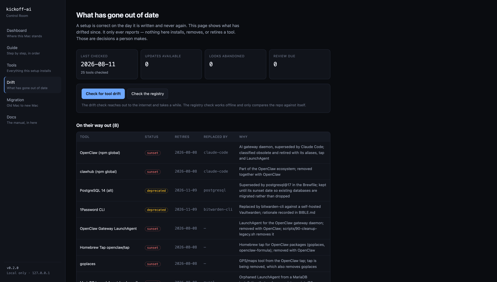

# 07 — The Currency System

> [Deutsch](de/07-AKTUALITAET.md)

A setup repo is correct on the day it is created. After that, it is not.

Tools move on: new versions appear, some are deprecated, new ones emerge that did not
exist when the repo was written. Without a system that makes this drift visible and
documents it, the repo is worthless within a year.

---

## The Problem

```
Day 0:   tools.yaml ← correct ← machine state
Day 90:  tools.yaml ← ?       ← machine state (16 updates, 2 deprecated)
Day 365: tools.yaml ← wrong   ← machine state (has become irrelevant)
```

Three concrete consequences:
1. New machines are provisioned with outdated versions.
2. Tools that are deprecated or archived upstream remain silently installed.
3. The repo loses its value as a reference.

---

## The Answer in Four Parts

```
manifests/tools.yaml          ← 1. Registry: single source of truth
        ↓
automation/bin/up2date        ← 2. Checker: reads upstream, reports drift
        ↓
automation/bin/sunset         ← 3. State machine: documents decisions
        ↓
.github/workflows/            ← 4. CI: keeps everything alive indefinitely
```

### 1. Registry: `manifests/tools.yaml`

The single source of truth for all tools in this setup. Schema: [manifests/schema.md](../manifests/schema.md).

Every entry has:
- A clear origin (`source`, `ref`)
- An honest status (`candidate → active → deprecated → sunset`)
- A rationale (`why`) — not an empty required field
- A version-check method (`version_check`, `check_ref`)

The implementation lists (Brewfile, ollama-models.txt etc.) are the **execution**;
`tools.yaml` is the **decision**. Both must match — CI verifies this.



The Control Room renders the same data the commands below produce. Note what the page does not
have: a button that adopts, retires, or installs anything. That is INV-1 as a user interface.

#### Public reference, private machine state

The registry is split across two files, and the split is itself a governance decision:

| File | Contains | Published |
|---|---|---|
| `manifests/tools.yaml` | The curated reference: tools this setup installs or deliberately tracks, each with an impersonal reason | yes |
| `local/manifests/tools.local.yaml` | What one particular machine turned out to have — findings from `mac-snapshot` and `sunset propose`, and the owner's own decision notes | no, `local/` is gitignored |

Both use the same schema. Every reader — `up2date`, `sunset`, `migration-diff` and the
Control Room — reads the public file and lays the local one on top: an `id` present in both is
answered by the local entry, and new ids are added. Writes go back to whichever file owns the
entry, so a machine-specific note can never land in the published manifest.

The reason for the split: **a reference manifest and a machine's actual state are different
things, and the second one is private by design.** A published inventory that also reports what
is installed on a named person's laptop is a self-disclosure, not a reference. The rule is
enforced rather than remembered — `scripts/checks/registry-privacy.sh` fails the gate when the
public file starts describing a specific machine again.

### 2. Checker: `automation/bin/up2date`

Read-only against the system. Checks every active/candidate entry against upstream
and reports four categories:

| Category | What | Source of signal |
|---|---|---|
| **Update available** | Upstream version > version_seen | brew/npm/GitHub API |
| **Sunset candidate** | Upstream deprecated/disabled/archived | brew deprecated flag, npm deprecated field, GitHub archived |
| **Adoption candidate** | Installed locally, not in registry | brew leaves, npm ls -g (local only) |
| **Review due** | `reviewed` older than 180 days | registry field |

Important: the checker **installs and uninstalls nothing**. It states the concrete
command for the next step — the human runs it.

### 3. State Machine: `automation/bin/sunset`

```
candidate ──► active ──► deprecated ──► sunset ──► (entry removed)
    └──────── adopt ──┘     ↑ propose    ↑ confirm      ↑ manual
                            └─── revive ─┘
                                  ↑
                               revive
```

- `propose`: Starts a 90-day grace period. Writes to CHANGELOG.
- `confirm`: Confirms sunset after the grace period expires. Writes to CHANGELOG.
- `revive`: Reactivates. Rationale required. Writes to CHANGELOG.
- `adopt`: Moves `candidate` to `active`.

**Every status change is a human decision** — never automatic.
The workflow surfaces what is due; the human decides.

### 4. CI: `.github/workflows/`

| Workflow | Trigger | What it does |
|---|---|---|
| `validate.yml` | push, PR | shell syntax, ShellCheck, sanitization, YAML schema, consistency check |
| `up2date.yml` | Monday 08:00 UTC | upstream check, PR for version updates, issue for findings |
| `release.yml` | tag v* | validate, release notes from CHANGELOG, GitHub release |

---

## The Weekly Cycle

```
Monday 08:00 UTC
    ↓
up2date.yml starts
    ↓
automation/bin/up2date check --json --markdown
    ↓
automation/bin/up2date --apply-versions
    ↓
tools.yaml changed?
    ├─ yes → PR: "chore/up2date-<run-id>" (version_seen, reviewed, STATE.json only)
    └─ no  → no PR
    ↓
Sunset candidates or reviews due?
    ├─ yes → create/update issue (constant title → no duplicate)
    └─ no  → no issue
    ↓
Human receives:
    ├─ PR to merge (version update) — no status changed
    └─ issue with command suggestions — decision stays with the human
```

**What comes as a PR:** Only `version_seen`, `reviewed`, `STATE.json`. Never `status`.

**What comes as an issue:** List of sunset candidates and overdue reviews,
with the suggested `sunset propose` or `sunset adopt` command for each.
Execution remains with the human.

**What never happens automatically:** Status changes, installation, uninstallation.

---

## Adding a Tool

```bash
# 1. Add entry in manifests/tools.yaml (status: candidate)
# 2. Update the implementation list (Brewfile, ollama-models.txt, etc.)
# 3. Check consistency
automation/bin/up2date --consistency --offline

# 4. After evaluation: adopt
automation/bin/sunset adopt <id>

# 5. Check whether a PR is needed
git diff manifests/tools.yaml
```

---

## Retiring a Tool

```bash
# Phase 1: Propose retirement (today + 90 days)
automation/bin/sunset propose <id> --reason "Why" [--replaced-by <successor-id>]

# Interim: tool remains installed and functional
automation/bin/sunset list --due         # Who is due?

# Phase 2: After 90 days — confirm sunset
automation/bin/sunset confirm <id>

# Phase 3: Remove the software (deliberate third step)
./scripts/90-cleanup-legacy.sh  # or the relevant module script

# Phase 4: Remove entry from registry + update CHANGELOG
# → delete line from tools.yaml, add under [Unreleased] / Removed
```

### Integration with `scripts/90-cleanup-legacy.sh`

The script currently removes **hardcoded** legacy cruft (OpenClaw and the orphaned
MariaDB LaunchAgent). The registry (`tools.yaml`) documents both entries as `status: sunset`.

**Planned but deliberately not yet implemented:**
In a future version `90-cleanup-legacy.sh` would read the `sunset` entries from
`tools.yaml` dynamically. Tool IDs in the script would no longer be hardcoded but
would come from the registry. This integration is **not** implemented automatically
because uninstallation must always remain an explicit human decision.

---

## Repository Versioning

Format: Semantic Versioning (SemVer, starting at `0.1.0`).
Changelog: Keep a Changelog (categories: Added / Changed / Deprecated / Removed / Fixed).

| Type of change | Version |
|---|---|
| Setup no longer backward-compatibly reproducible (bootstrap level changed, module removed) | MAJOR |
| Tool added or module extended (new script, new category) | MINOR |
| Versions updated, documentation, bugfixes, consistency | PATCH |

Release workflow:
```bash
# CHANGELOG.md: [Unreleased] → [0.2.0] — YYYY-MM-DD
# Update VERSION
echo "0.2.0" > VERSION

git add CHANGELOG.md VERSION
git commit -m "chore: Release 0.2.0"
git tag v0.2.0
git push origin main v0.2.0
# → release.yml handles the rest
```

---

## Check Methods by Source

| Source | Method | Automatic? | Notes |
|---|---|---|---|
| `brew` (formula) | `brew info --json=v2` | yes | Detects deprecated/disabled flag |
| `brew` (cask) | `brew info --json=v2` | yes | Version number, no deprecated flag |
| `npm` | `npm view <pkg> version` + `deprecated` | yes | deprecated field = sunset candidate |
| `github-release` | GitHub Releases API | yes | archived=true = sunset; `GITHUB_TOKEN` for rate limit |
| `mas` | `mas info` + `mas outdated` | yes | Only when mas is installed |
| `ollama` | Ollama Registry API | best effort | No stable version format; reports `unknown` rather than guessing |
| `manual` | Not checkable | no | Checked via `reviewed` age (>180 days = review due) |
| `curl`-installed | via `version_check` = github-release/manual | depends on tool | Fallback: github-release if project is on GitHub |
| `uv` tool | `pip index versions` | manual | uv tool versions: `uv tool list`; upstream version via PyPI |
| Ollama models | Ollama Registry | best effort | Model tags change rarely; `unknown` on errors |

### Cases That Only Work as `manual`

- Desktop apps without an update API (some casks)
- LaunchAgents and system configuration
- Tools from private sources
- Ollama models with unclear versioning scheme
- Built-in tools (Xcode components, Swift compiler via Xcode)

---

## Limits (What Deliberately Does Not Happen Automatically)

| What | Why |
|---|---|
| **Status changes** | Every deprecated/sunset decision involves a human trade-off |
| **Installation** | New versions are reported, not applied; installation carries regression risk |
| **Uninstallation** | Removing software can break running projects; always explicit |
| **Secrets in CI** | No tokens in the registry; `GITHUB_TOKEN` is automatically available |
| **Extension versions** | VS Code extensions have no stable version scheme in the registry; managed via `config/vscode-extensions.txt` |

---

## Sanitization Denylist and Allowlist

The `validate.yml` workflow uses two file pairs for the sanitization scan:

**Denylist:**
- `.github/sanitize-denylist.txt` (public, core patterns)
- `local/sanitize-denylist-private.txt` (gitignored, your own private terms)

**Allowlist:**
- `.github/sanitize-allowlist.txt` (public, documented exceptions including the repo URL)
- `local/sanitize-allowlist-private.txt` (gitignored, your own private exceptions)

```bash
# Create a private denylist (gitignored):
mkdir -p local
cat > local/sanitize-denylist-private.txt <<'EOF'
# Private terms (regex, one per line)
MyClientName
my-private-project
EOF

# Create a private allowlist (gitignored):
cat > local/sanitize-allowlist-private.txt <<'EOF'
# Lines matching this pattern are not treated as findings
my-special-permitted-expression
EOF
```

Full description of the scan mechanism: [05-SANITIZATION.md](05-SANITIZATION.md)
