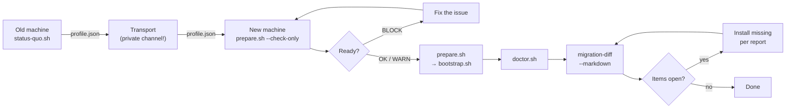

# 09 — Machine Migration

> [Deutsch](de/09-UMZUG.md)

Setting up a new MacBook without losing the state of the previous one.
This document describes the complete procedure — for yourself and for someone
using this setup for the first time.

---

## The Cycle at a Glance



---

## Day −1 — On the OLD Machine

### 1. Export the State

```bash
cd ~/dev/kickoff-ai
./status-quo.sh
```

Output goes to `local/status-quo/<YYYY-MM-DD>/`:

| File | Contents |
|------|----------|
| `profile.json` | Machine-readable profile for `migration-diff` |
| `repos.md` | Git repos with remote, branch, and open state |
| `STATUS-QUO.md` | Human-readable full report |
| `manuell.md` | **To-do list** — what you must handle manually |

### 2. Push Open State

`repos.md` shows all repos with uncommitted or unpushed state.
These **must be pushed before the migration** — the new machine clones,
it does not copy. Local state that was never pushed is gone after the move.

```bash
# Example: check all repos with open state
open local/status-quo/$(date +%Y-%m-%d)/repos.md
```

Repos without a remote are listed separately in `repos.md`. Options:
create a remote and push, or transfer the directory manually via `rsync` / AirDrop.

### 3. Secrets to Vaultwarden

The profile contains **no** secrets — only names and locations.
All secrets must be secured before the migration.
Procedure: [08-SECRETS.md](08-SECRETS.md).

Checklist:
- [ ] SSH private keys: store in Vaultwarden or generate fresh on the new machine
- [ ] API keys from environment variables (`.env` files, shell config)
- [ ] Database passwords from Docker Compose files
- [ ] App licences (JetBrains, Adobe, etc.)

### 4. Backup

Recommended: full Time Machine backup before handing off the machine.
The script does not replace a backup — it only captures what is versioned and
reproducible.

---

## Day 0 — On the NEW Machine

### 1. Check Readiness (Changes NOTHING)

No Homebrew, no git, no repo needed — only `curl` and `/bin/bash`
(both available on every macOS):

```bash
/bin/bash -c "$(curl -fsSL https://raw.githubusercontent.com/leonkoellerwirth-arch/kickoff-ai/main/prepare.sh)" -- --check-only
```

The output shows a table with `OK`, `WARN`, and `BLCK` (blocker).

**BLOCK** means: the setup cannot start as-is.
Common blockers: no internet connection, no admin access, insufficient storage.

**WARN** means: everything runs but there is something to be aware of
(e.g. Intel chip, on battery, no FileVault).

### 2. Start the Setup

```bash
# Option A: one-liner (clones and starts bootstrap.sh --level 0)
/bin/bash -c "$(curl -fsSL https://raw.githubusercontent.com/leonkoellerwirth-arch/kickoff-ai/main/prepare.sh)"

# Option B: with profile from the old machine
/bin/bash -c "$(curl -fsSL .../prepare.sh)" -- --profile /Volumes/USB/profile.json

# Option C: clone only, start bootstrap.sh manually
/bin/bash -c "$(curl -fsSL .../prepare.sh)" -- --no-bootstrap
```

### 3. Choose a Bootstrap Level

`prepare.sh` delegates to `bootstrap.sh --level N`:

| Level | Duration | What is set up |
|-------|----------|----------------|
| 0 | ~15 min | CLT, minimal brew formulae, shell, Node, git, Claude Code |
| 1 | ~45 min | + full Brewfile, Python (uv), macOS defaults, VS Code |
| 2 | ~2 h | + Docker, Xcode (full), Codex, Gemini CLI, Ollama |
| 3 | ~3 h+ | + Brewfile.optional, automation layer |

For a quick working-state test: `--level 0`.
For the full stack: `--level 2` or `--level 3`.

---

## Transporting the Profile

`local/status-quo/<DATE>/profile.json` contains:
- Toolchain versions
- List of installed formulae, casks, extensions, models
- macOS settings

It contains **no secrets**, but repo names, tool names, and the directory structure
of the old machine. That is **machine-specific and personal** — the profile does not
belong in a public channel (no GitHub repo, no Slack, no email attachment to strangers).

Secure transport methods:
- USB stick
- AirDrop (to your own devices only)
- Your own encrypted cloud storage
- `scp` / `rsync` over a local network

---

## After Setup — Final Check

### 1. System Check

```bash
cd ~/dev/kickoff-ai
./doctor.sh
```

Doctor checks ~42 points and reports PASS / WARN / FAIL.
Fix all FAILs, then proceed.

### 2. Migration Diff

```bash
./automation/bin/migration-diff --markdown
```

Compares the profile of the old machine against the current state of the new one.
Output in categories:

| Category | Meaning |
|----------|---------|
| **still missing** | Was on the old machine, not here yet |
| **newly added** | Here now, was not on the old machine |
| **version difference** | Present on both, different version |
| **deliberately retired** | Status `sunset` or `deprecated` in `manifests/tools.yaml` |

For every open item the tool outputs the concrete command to resolve it.
Exit code 0 when nothing is open, 1 when open items remain.

**What "deliberately retired" means:**
Tools with status `sunset` or `deprecated` in `manifests/tools.yaml` are not counted
as "missing". They were intentionally not carried over to the new machine. The report
lists them separately so nothing disappears unnoticed.

### 3. Following Up

For every open item `migration-diff` lists the concrete command.
Write the report with `--markdown` to `local/migration-diff.md` and check off
items one by one.

---

## Limits — What the Export Cannot Do

| What is missing | Why / Workaround |
|-----------------|------------------|
| **Secrets and API keys** | Deliberate boundary — [08-SECRETS.md](08-SECRETS.md) |
| **App Store purchases** | Licences with Apple, no export possible — reload in App Store |
| **JetBrains licences** | JetBrains account → reinstall Toolbox |
| **Docker volumes (data)** | `docker run --volumes-from` or export manually |
| **Ollama models** | **Re-downloaded** on the new machine (`ollama pull`) |
| **Local databases** | `mysqldump` / `pg_dump` before migration — not automated |
| **conda environments** | `conda env export > env.yml` and import on the new machine |
| **LaunchAgent contents** | Only names captured — check PLISTs manually and restore |
| **Logins and cookies** | Browser sync or manually |

---

## Quick Reference

```bash
# On the old machine: export
./status-quo.sh

# Transport: save profile.json (not public!)

# On the new machine: check
/bin/bash -c "$(curl -fsSL https://raw.githubusercontent.com/leonkoellerwirth-arch/kickoff-ai/main/prepare.sh)" -- --check-only

# On the new machine: setup
/bin/bash -c "$(curl -fsSL https://raw.githubusercontent.com/leonkoellerwirth-arch/kickoff-ai/main/prepare.sh)"

# Finish
./doctor.sh
./automation/bin/migration-diff --markdown
```
