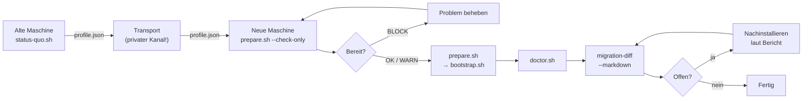

# 09 — Maschinenumzug

> [English](../09-MIGRATION.md)

Ein neues MacBook in Betrieb nehmen, ohne den bisherigen Stand zu verlieren.
Dieses Dokument beschreibt den vollständigen Ablauf — für dich selbst und für
jemanden, der dieses Setup zum ersten Mal benutzt.

---

## Der Zyklus in einem Bild



---

## Tag −1 — Auf der ALTEN Maschine

### 1. Status exportieren

```bash
cd ~/dev/kickoff-ai
./status-quo.sh
```

Ausgabe geht nach `local/status-quo/<YYYY-MM-DD>/`:

| Datei | Inhalt |
|-------|--------|
| `profile.json` | Maschinenlesbares Profil für `migration-diff` |
| `repos.md` | Git-Repos mit Remote, Branch, offenem Stand |
| `STATUS-QUO.md` | Menschenlesbarer Gesamtbericht |
| `manuell.md` | **To-do-Liste** — was du manuell erledigen musst |

### 2. Offene Stände pushen

`repos.md` zeigt alle Repos mit uncommittiertem oder ungepushtem Stand.
Diese **müssen vor dem Umzug gepusht werden** — die neue Maschine klont,
sie kopiert nicht. Lokaler Stand, der nie gepusht wurde, ist danach weg.

```bash
# Beispiel: alle Repos mit offenem Stand prüfen
open local/status-quo/$(date +%Y-%m-%d)/repos.md
```

Repos ohne Remote sind in `repos.md` separat ausgewiesen. Optionen:
remote anlegen und pushen, oder das Verzeichnis per `rsync` / AirDrop
manuell auf die neue Maschine übertragen.

### 3. Secrets nach Vaultwarden

Das Profil enthält **keine** Secrets — nur Namen und Fundorte.
Vor dem Umzug müssen alle Geheimnisse gesichert sein.
Ablauf: [08-SECRETS.md](08-SECRETS.md).

Checkliste:
- [ ] SSH-Private-Keys: in Vaultwarden oder auf neuer Maschine neu generieren
- [ ] API-Keys aus Umgebungsvariablen (`.env`-Dateien, Shell-Config)
- [ ] Datenbankpasswörter aus Docker-Compose-Dateien
- [ ] App-Lizenzen (JetBrains, Adobe, etc.)

### 4. Backup

Empfohlen: vollständiges Time-Machine-Backup bevor die Maschine weggegeben
wird. Das Skript ersetzt kein Backup — es sichert nur was versioniert und
reproduzierbar ist.

---

## Tag 0 — Auf der NEUEN Maschine

### 1. Bereitschaft prüfen (ändert NICHTS)

Kein Homebrew, kein git, kein Repo nötig — nur `curl` und `/bin/bash`
(beide auf jedem macOS vorhanden):

```bash
/bin/bash -c "$(curl -fsSL https://raw.githubusercontent.com/leonkoellerwirth-arch/kickoff-ai/main/prepare.sh)" -- --check-only
```

Die Ausgabe zeigt eine Tabelle mit `OK`, `WARN` und `BLCK` (Blocker).

**BLOCK** bedeutet: das Setup kann so nicht starten.
Häufige Blocker: keine Internetverbindung, kein Admin-Zugang, zu wenig Speicher.

**WARN** bedeutet: alles läuft, aber es gibt etwas zu beachten
(z.B. Intel-Chip, Batteriebetrieb, kein FileVault).

### 2. Setup starten

```bash
# Variante A: Einzeiler (klont und startet bootstrap.sh --level 0)
/bin/bash -c "$(curl -fsSL https://raw.githubusercontent.com/leonkoellerwirth-arch/kickoff-ai/main/prepare.sh)"

# Variante B: mit Profil von der alten Maschine
/bin/bash -c "$(curl -fsSL .../prepare.sh)" -- --profile /Volumes/USB/profile.json

# Variante C: nur klonen, bootstrap.sh manuell starten
/bin/bash -c "$(curl -fsSL .../prepare.sh)" -- --no-bootstrap
```

### 3. Bootstrap-Stufe wählen

`prepare.sh` übergibt an `bootstrap.sh --level N`:

| Stufe | Dauer | Was wird eingerichtet |
|-------|-------|-----------------------|
| 0 | ~15 Min | CLT, minimale brew-Formeln, Shell, Node, git, Claude Code |
| 1 | ~45 Min | + vollständiges Brewfile, Python (uv), macOS-Defaults, VS Code |
| 2 | ~2 h | + Docker, Xcode (vollständig), Codex, Gemini CLI, Ollama |
| 3 | ~3 h+ | + Brewfile.optional, Automation-Ebene |

Für einen schnellen Arbeitsfähigkeits-Test: `--level 0`.
Für den vollen Stack: `--level 2` oder `--level 3`.

---

## Das Profil transportieren

`local/status-quo/<DATUM>/profile.json` enthält:
- Toolchain-Versionen
- Liste der installierten Formulae, Casks, Extensions, Modelle
- macOS-Einstellungen

Es enthält **keine Secrets**, aber Repo-Namen, Toolnamen und die
Verzeichnisstruktur der alten Maschine. Das ist **maschinenspezifisch
und personenbezogen** — das Profil gehört nicht in einen öffentlichen Kanal
(kein GitHub-Repo, kein Slack, kein E-Mail-Anhang an Fremde).

Sichere Transportwege:
- USB-Stick
- AirDrop (nur an eigene Geräte)
- Eigener verschlüsselter Cloudspeicher
- `scp` / `rsync` über lokales Netz

---

## Nach dem Setup — Abschluss-Check

### 1. System-Check

```bash
cd ~/dev/kickoff-ai
./doctor.sh
```

Doctor prüft ~41 Punkte und meldet PASS / WARN / FAIL.
Alle FAILs beheben, dann weiter.

### 2. Migrations-Abgleich

```bash
./automation/bin/migration-diff --markdown
```

Vergleicht das Profil der alten Maschine mit dem aktuellen Zustand
der neuen Maschine. Ausgabe in Kategorien:

| Kategorie | Bedeutung |
|-----------|-----------|
| **fehlt noch** | War auf alter Maschine, hier nicht vorhanden |
| **neu hinzugekommen** | Hier vorhanden, war auf alter Maschine nicht |
| **Versionsunterschied** | Beidseitig vorhanden, andere Version |
| **bewusst abgelegt** | Status `sunset` oder `deprecated` in `manifests/tools.yaml` |

Für jede offene Position gibt das Tool den konkreten Befehl zum Nachholen.
Exit-Code 0 wenn nichts offen, 1 wenn offene Positionen vorhanden.

**Was „bewusst abgelegt" bedeutet:**
Tools, die in `manifests/tools.yaml` den Status `sunset` oder `deprecated` haben,
werden nicht als „fehlt" gewertet. Sie wurden absichtlich nicht auf die neue
Maschine übernommen. Der Bericht zeigt sie separat aus, damit nichts unbemerkt
verloren geht.

### 3. Nachholen

Für jeden offenen Punkt listet `migration-diff` den konkreten Befehl.
Bericht mit `--markdown` in `local/migration-diff.md` schreiben und
Punkt für Punkt abhaken.

---

## Grenzen — was der Export nicht kann

| Was fehlt | Warum / Ausweg |
|-----------|----------------|
| **Secrets und API-Keys** | Bewusste Grenze — [08-SECRETS.md](08-SECRETS.md) |
| **App-Store-Käufe** | Lizenzen bei Apple, kein Export möglich — in App Store neu laden |
| **JetBrains-Lizenzen** | JetBrains-Konto → Toolbox neu installieren |
| **Docker-Volumes (Daten)** | `docker run --volumes-from` oder manuell exportieren |
| **Ollama-Modelle** | Werden auf neuer Maschine **neu geladen** (`ollama pull`) |
| **Lokale Datenbanken** | `mysqldump` / `pg_dump` vor Umzug — nicht automatisiert |
| **conda-Umgebungen** | `conda env export > env.yml` und auf neuer Maschine importieren |
| **LaunchAgent-Inhalte** | Nur Namen erfasst — PLISTs manuell prüfen und wiederherstellen |
| **Logins und Cookies** | Browser-Sync oder manuell |

---

## Schnellreferenz

```bash
# Auf alter Maschine: exportieren
./status-quo.sh

# Transport: profile.json sichern (nicht öffentlich!)

# Auf neuer Maschine: prüfen
/bin/bash -c "$(curl -fsSL https://raw.githubusercontent.com/leonkoellerwirth-arch/kickoff-ai/main/prepare.sh)" -- --check-only

# Auf neuer Maschine: setup
/bin/bash -c "$(curl -fsSL https://raw.githubusercontent.com/leonkoellerwirth-arch/kickoff-ai/main/prepare.sh)"

# Abschluss
./doctor.sh
./automation/bin/migration-diff --markdown
```
